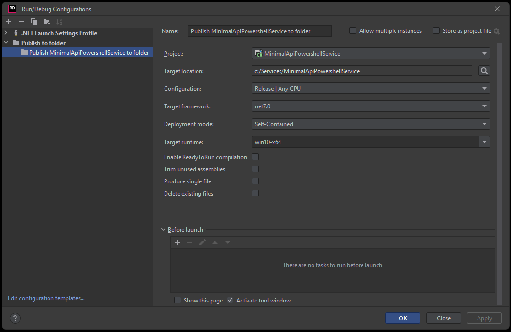
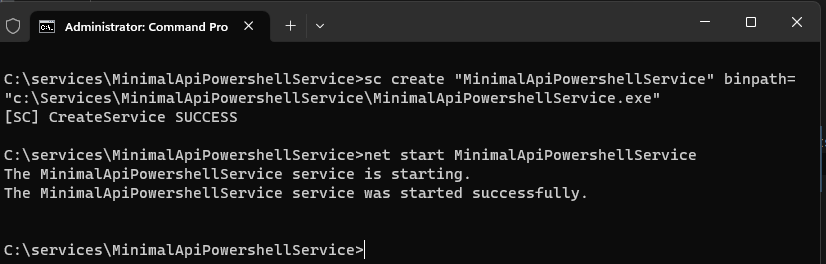
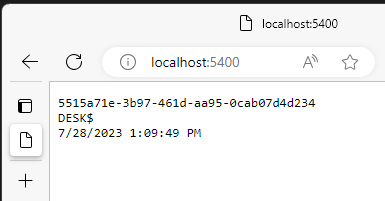

# Dotnet 7 PowerShell Service
A sample project to run PowerShell in a Dotnet 7 windows service.

This simple project shows running PowerShell commands from a windows 
service that are activated by a GET request on an API. The service passes
a parameter to the PowerShell script and displays that with the current 
user and time in the browser, as well as writing this data to a file in 
c:\temp. Windows event logging has been enabled in ``appsettings.json``

It is import to target a specific OS in the configuration. Targeting 
generic win-64 will not allow powershell to work. At this time, single file publishing also 
does not work.

### Configure
The port used by the service is specified in ``appsettings.json``. Note that different ports are configured in ``appsettings.Development.json``.
#### Secure access to the API
With the posted configuration, the service API is only accessible from localhost using http.  If you need the service to 
be available from other machines on your network, I would recommend preventing eavesdropping by configuring use of an 
SSL certificate.  
1. Install the certificate in the Windows Certificate Store using `certmgr.exe` into the Personal store
2. Get the location and validate the path with this powershell command. Note the location LocalMachine\\**My** and the private key is available:

````
PS C:\> Get-ChildItem -Path cert:\ -Recurse | Where-Object { $_.Subject -imatch "desk.domain.com" } | Select Subject, HasPrivateKey, PsParentPath

Subject            HasPrivateKey PSParentPath
-------            ------------- ------------
CN=desk.domain.com          True Microsoft.PowerShell.Security\Certificate::CurrentUser\My
````

3. Add the FQDN from the certificate to AllowedHosts in `appsettins.json`:

``"AllowedHosts": "desk.domain.com;localhost"``

4. Add an HTTPS entry:

```
  "Kestrel": {
    "Endpoints": {
      "Http": {
        "Url": "http://localhost:5400"
      },
      "Https": {
        "Url": "https://desk.domain.com:5401",
        "Certificate": {
          "Subject": "desk.domain.com",
          "Store": "My",
          "Location": "LocalMachine",
          "AllowInvalid": false
        }
      }
    }
  }

```

### Publish
To publish the project, mark the project as self contained and target 
the specific OS runtime. Generic win-x64 will fail.

``dotnet publish -o C:\Services\MinimalApiPowershellService\ --sc --runtime win10-x64``

This is the publishing profile in Rider:


### Create a service
Finally, create a service on your windows system using this command:

``sc create "MinimalApiPowershellService" binpath="c:\Services\MinimalApiPowershellService\MinimalApiPowershellService.exe"``


Once the service is created you can start it right away, or configure it 
to run under specific user context. When running under a specific user context, make sure to check the permissions 
for this user.

### Test
With the service running you can test it by connecting to 
http://localhost:5400 from a web browser or a PowerShell 
command ``Invoke-WebRequest -Uri "http://localhost:5400"``



### Troubleshooting
If the service will not run, check the event log for any errors.